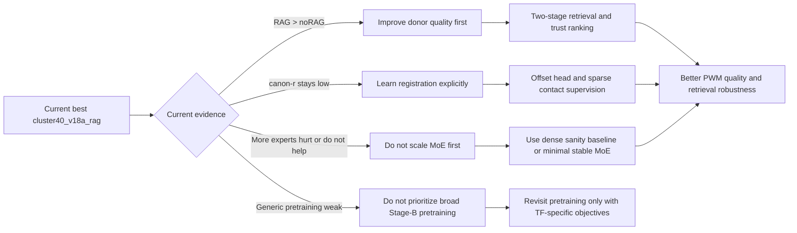
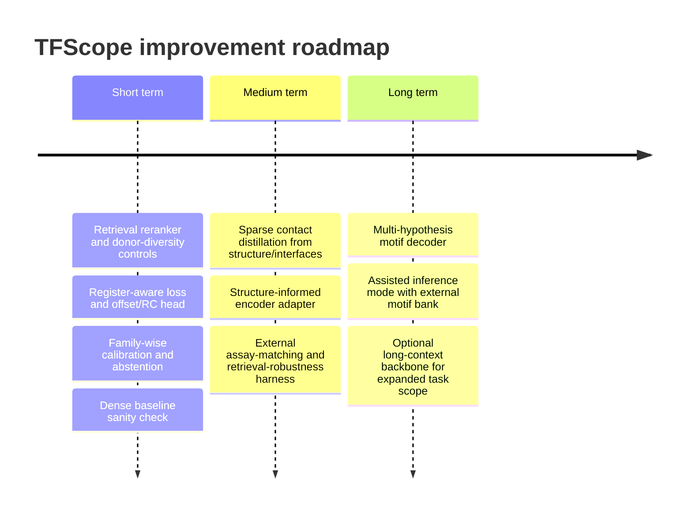

# Improving the TFScope Architecture

## Executive summary

Based on the uploaded architecture and benchmark note, TFScope is already close to the right small-data design point: a frozen protein language model with lightweight adaptation, explicit DBD masking, family-conditioned latent processing, explicit retrieval of related TF motifs, and a PWM-first decoder. The strongest empirical facts in your current results are also unusually clear. Retrieval is genuinely valuable, improving the primary cluster40 metric from 0.535 to 0.592 gate-r over the matched noRAG baseline, while fixed-register performance remains low at canon-r = 0.136, meaning that **donor quality** and **motif registration** dominate the remaining error budget. At the same time, larger/finer MoE variants and generic Stage-B pretraining do not improve the headline metric, which is strong evidence that capacity scaling is not the present bottleneck. fileciteturn0file0

That prioritization matches adjacent literature. Retrieval-augmented and nearest-neighbor systems tend to help most when the task benefits from access to explicit, high-quality exemplar memory, especially in long-tail settings; dense or late-interaction retrieval can further improve candidate quality without forcing a larger generator. Conversely, sparse expert models can scale capacity efficiently, but their gains depend on stable routing and enough data for expert specialization, and are often limited by routing instability rather than raw parameter count. citeturn39view1turn39view0turn25view0turn25view1turn39view4turn19view1turn19view0

The implication is straightforward. The next TFScope iteration should **not** begin with a bigger backbone, more experts, or broader generic pretraining. It should begin with: a better retrieval stack, an explicit register-aware decoder/loss, a separate and properly calibrated confidence layer, and sparse/structure-informed contact supervision targeted specifically at the current registration failure mode. Only after those changes stabilize should you invest in a structure-informed encoder adapter or a multi-hypothesis motif decoder. That sequence also preserves TFScope’s core niche—**sequence-only motif nomination for orphan and held-out TFs**—while making the system more rigorous, more interpretable, and more reliable at abstaining when it should. fileciteturn0file0 citeturn39view2turn20view0turn9view0

| Priority | Recommendation | Why this should come first | Estimated ROI |
|---|---|---|---|
| Highest | Retrieval reranking and donor-quality controls | Your own results show retrieval is the biggest existing gain lever | High |
| Highest | Registration-aware loss and offset/RC head | canon-r is the clearest unresolved failure mode | High |
| High | Separate trust from final confidence; calibrate family-wise | Needed for honest user-facing confidence and abstention | High |
| Medium-high | Sparse contact distillation from structure or interfaces | Most direct mechanistic route to improving registration | Medium-high |
| Medium | Structure-informed adapter on top of current PLM | Useful after retrieval/alignment are fixed | Medium |

The core databases and downstream ecosystem also argue for keeping TFScope PWM-first in the near term. HumanTFs exposes official human TF and motif lists plus PWM files and DBD alignments; HOCOMOCO v14 provides curated models and secondary subtypes from ChIP-seq, HT-SELEX, GHT-SELEX, SMiLE-seq, and PBM; JASPAR 2026 remains an open, curated matrix resource with an API and a deep-learning collection; CIS-BP provides a broad cross-species motif library. These resources are all matrix-centric, which means improved PWM prediction remains the most interoperable target format for training, retrieval, comparison, and biological validation. citeturn16view0turn17view0turn16view1turn17view1

## Current architecture assessment

The architecture diagram itself was not attached as a separate machine-readable artifact in the prompt, so the summary below is inferred from the uploaded implementation-and-results note. Where the note is explicit, I mark the component as confirmed. Where the note does not specify the exact implementation, I mark the item as an assumption. fileciteturn0file0

| Component | Likely current implementation | Evidence status |
|---|---|---|
| Sequence encoder | Frozen ESM-2 650M backbone, LoRA on q_proj/v_proj in last 6 layers, learned scalar mix over last 4 layers | Confirmed |
| Input features | DBD + linker sequence, amino-acid tokens, `dbd_mask`, `family_id` | Confirmed |
| DBD prior | Learned DBD indicator added to masked residues; dual global and DBD pooling | Confirmed |
| Pooling | Dual-stream gated attention pooling, global + DBD-masked | Confirmed |
| Family conditioning | Family-aware MoE routing, FiLM modulation, prototype dictionary | Confirmed |
| noRAG baseline | Same or near-identical architecture with retrieval branch disabled or zeroed | Likely, but baseline implementation details are not fully spelled out |
| Retrieval module | Offline DBD embedding index, leave-one-out cosine neighbors from train∪val, top-K = 3, learned `TrustPredictor`, trust-gated log-PWM prior, retrieval dropout | Confirmed |
| PWM decoder | Position gate head + prior branch + contact-aware residual decoder, current best with softmax attention | Confirmed |
| Motif length handling | Predicted per-position gate instead of discrete length class | Confirmed |
| Confidence calibration | Trust predictor and retrieval-confidence β-gate are present; exact user-facing post-hoc calibration layer is not described in the note | Partially specified; exact calibrator assumed unspecified |
| Benchmarking | Primary honest OOD split is cluster40; current best is `cluster40_v18a_rag`; evaluation centers on gate-r with fixed ≥4-position rule | Confirmed |

The current benchmark evidence points to four bottlenecks and one anti-priority. First, retrieval works and should be improved, not sidelined. Second, registration is the main unresolved error class, because the gap between gate-r and canon-r is very large. Third, expanding taxonomy granularity or expert count is not currently helpful. Fourth, generic pretraining did not transfer well to the primary metric, even if it modestly affected fixed-register behavior. The anti-priority is therefore clear: **do not spend early cycles on making the latent block larger or more complicated.** fileciteturn0file0



One further architectural principle is worth preserving. DeepBind showed early on that deep learning could infer binding specificity from sequence assay data and expose the result as PWM-like motif representations or mutation maps, while BPNet showed that richer profile models and interpretation tools can recover motifs and cooperative syntax at base resolution. TFScope’s current PWM-first interface therefore remains scientifically defensible; the improvement opportunity is not to abandon PWM output, but to make the PWM output better aligned, better calibrated, and better grounded in explicit exemplar memory and protein-side contacts. citeturn29view0turn34view0

## Candidate improvements

The most useful way to improve TFScope is to treat each module according to its actual error budget contribution, not according to generic model-fashion incentives. The table below therefore emphasizes retrieval, registration, calibration, and structure-guided supervision, while treating MoE scaling and encoder swaps as selective, secondary investments.

| Component | Concrete improvement options | Pros | Cons and risks | Complexity and compute | Expected impact |
|---|---|---|---|---|---|
| Sequence encoder | Keep frozen PLM, but upgrade to **LoRA+**; widen layer mixing beyond last-4 only; optionally add a **structure-informed adapter** instead of a full backbone swap; only consider long-context PLMs if input scope expands beyond DBD+linkers | Cheap, preserves current training recipe, stronger adaptation efficiency, better access to middle-layer biological concepts, possible structural bias without full structure dependency | Small data may not support aggressive backbone changes; new checkpoints complicate reproducibility; long-context models are unnecessary for current ~111 aa median inputs | Low to medium; low GPU cost for LoRA+, medium for structure adapters | Oracle r: +0.005 to +0.03; IC error: 5–15% lower; calibration: neutral; retrieval robustness: low indirect gain |
| DBD mask and region priors | Replace binary DBD mask with **multi-channel residue priors**: DBD, predicted DNA-contact residues, dimerization residues, linker, low-confidence structure regions; add region dropout so model cannot overfit a single mask channel | Better localization, better pooling, more interpretable contact attention, likely helps register placement | Requires building or importing residue-level priors; noisy pseudo-labels can hurt if unscreened | Medium; moderate preprocessing | Oracle r: +0.005 to +0.02; canon-r: +0.01 to +0.03; IC error: modestly lower; robustness: medium |
| Family conditioning and MoE | Do **not** scale experts first; test two minimal alternatives only: **Expert Choice routing** or a **dense SwiGLU sanity baseline**; add family dropout and hierarchical family embeddings | Reduces routing fragility, clarifies whether MoE is still earning its keep, may simplify deployment | Probably not the main metric lever right now; too much routing experimentation can waste time | Low to medium | Oracle r: −0.005 to +0.015; IC error: neutral; calibration: slight stability gain; robustness: medium |
| noRAG baseline | Train a stronger retrieval-free **student** via RAG-to-noRAG distillation; use a **retrieval-dropout curriculum** rather than fixed dropout; report orphan-specific performance explicitly | Stronger orphan behavior, better ablations, better fallback when no donor transfers | Distillation adds pipeline complexity; headline metric may still trail RAG | Medium | Oracle r on orphans: +0.005 to +0.02; IC error: modest improvement; calibration: better abstention; robustness: high for donor-poor TFs |
| RAG module | Expand candidate pool to **K = 8–16**, rerank to top-4 active donors; switch from pooled cosine only to **late-interaction reranking**; train trust with **hard negatives** and pairwise ranking; enforce donor diversity; optionally retrieve **motif subtypes** rather than genes only | Directly targets the best current lever; should improve donor quality, reduce false trust in paralog-like neighbors, and increase robustness when top-1 donor is wrong | More moving parts in index and training; must be very strict about donor leakage and split hygiene | Medium; mostly indexing and modest training changes | Oracle r: +0.015 to +0.05; IC error: 5–20% lower; calibration: indirect improvement; retrieval robustness: high |
| PWM decoder and loss | Add **offset/RC prediction head**; train with a **register-aware composite loss** combining oracle-aligned and fixed-register terms; finally enable **entmax/sparsemax** attention in the contact branch; add optional **multi-hypothesis motif decoder** for TFs with known subtypes | Highest-value path for canon-r; directly addresses dominant failure mode; sparse attention should improve interpretability and contact selectivity; multi-hypothesis output fits biological subtype reality | Offset supervision must be carefully defined; sparse attention can destabilize early training; multi-hypothesis decoding raises evaluation complexity | Medium for offset loss, medium-high for sparse contact, high for multi-hypothesis | Oracle r: +0.005 to +0.02; canon-r: +0.03 to +0.10; IC error: modest reduction; robustness: medium |
| Confidence calibration | Decouple donor trust from final model confidence; fit **family-wise temperature scaling**, then isotonic fallback if needed; add **conformal intervals** for predicted oracle-r / IC quality; support abstention thresholds in inference | Major practical benefit, especially for orphan TF nomination and case studies; yields honest reliability diagrams and bounded uncertainty | Calibration on too-small or non-family-held-out sets will be optimistic; conformal intervals require clean split discipline | Low | Oracle r: ~0; IC error: ~0; calibration: ECE down 30–60%, valid coverage; robustness: high for abstaining on bad donors |
| Retrieval index and external bank | Move to a versioned **multi-view index** with pooled sequence embeddings, token-level donor reps, family embedding, and motif-cluster IDs; optionally build an **assisted external bank** from HOCOMOCO / JASPAR / CIS-BP reported separately from the closed-book benchmark | Better donors, faster experimentation, explicitly supports assisted inference, and clean separation between primary and assisted modes | External banks can inflate apparent generalization if mixed into the primary leaderboard; needs strict exclusion manifests | Medium | Oracle r: +0.005 to +0.03 in assisted mode; IC error: modest reduction; calibration: indirect; retrieval robustness: high |
| Training data and splits | Add **cluster30/40/70/90 difficulty curves**, leave-family-out, leave-paralog-out, leave-motif-cluster-out, gene-balanced sampling, and 3–5 seed reporting | This does not directly raise model accuracy, but it dramatically raises confidence that the gains are real, especially in a tiny-data regime | More experiments; slower iteration loop | Low to medium | Metric mean may not move, but statistical confidence and robustness improve substantially |

The highest-priority options above are well supported by adjacent literature. Retrieval augmentation and nearest-neighbor memories improve long-tail generalization and make better use of explicit exemplar stores; dense and late-interaction retrieval improve candidate quality without a larger generator; temperature scaling and conformal methods are strong practical calibration tools; sparsemax and entmax give genuinely sparse attention maps; structure-informed protein LMs and long-context PLMs offer targeted upgrades without forcing a full structural dependency; sparse autoencoders and motif-discovery tools improve interpretability on both the protein and DNA sides. citeturn39view1turn39view0turn25view0turn25view1turn39view2turn20view0turn39view5turn39view6turn27view0turn27view1turn21view1turn35view0turn35view1

The one family of methods I would explicitly **deprioritize** is “bigger sparse latent block.” Switch Transformers, ST-MoE, and Expert Choice all underscore that sparse experts can work well, but they also emphasize routing difficulty and utilization balance. In your own benchmark, a finer rebinning and more experts do not improve the main metric, which is a much more relevant empirical signal than any generic scaling argument. citeturn39view4turn19view1turn19view0 fileciteturn0file0

A final design recommendation is to remain **PWM-first** near term, even if you add richer internal representations. HOCOMOCO explicitly ships secondary motif subtypes and sequence-scanning tools; JASPAR exposes Matrix Align, an API, and now a deep-learning collection; HumanTFs ships motif lists, PWM files, and DBD alignments; CIS-BP remains a broad library of TF motifs. That ecosystem interoperability is a real advantage and should not be sacrificed lightly. citeturn17view0turn16view1turn16view0turn17view1

Recommended default hyperparameters for the top architectural changes are as follows.

| Change | Recommended defaults |
|---|---|
| Retrieval reranker | Candidate K = 16; active donors = 4; hard-negative pool = 8; same-family donor cap = 2; pairwise trust ranking margin = 0.1; retrieval dropout schedule = 0.30 → 0.10 over first 25–30 epochs |
| Register-aware loss | Shift range = ±10; RC bit predicted explicitly; register CE weight = 0.2; fixed-register loss weight = 0.3; oracle-aligned content loss retained at 1.0; early stopping on `gate-r + 0.5 * canon-r` |
| Sparse contact attention | Start with entmax15 or learnable α initialized near 1.3–1.5; contact distillation weight = 0.1; hub penalty = 0.01; row-diversity penalty = 0.01; residual λ init = 0.05 |
| Calibration | 5-fold family-wise cross-fit temperature scaling; isotonic fallback when sufficient calibration data exist; conformal α = 0.10; minimum 200 TF examples per family-conditional calibrator or fallback to global |
| Structure-informed adapter | Frozen base PLM; adapter bottleneck = 64 or 128; adapter lr = 3e-4; LoRA+ with rank 16 and A/B learning-rate ratio around 16:1; use only high-confidence structural pseudo-labels in early runs |

## Roadmap and experiment recipes

The roadmap below is intentionally arranged for Claude/Codex-style execution: discrete tasks, explicit file/module boundaries, and acceptance criteria tied to the **existing** `cluster40_v18a_rag` benchmark protocol, including the current ≥4-position evaluation rule. fileciteturn0file0



| Task | Code modules to touch | Tests to add | Acceptance criteria |
|---|---|---|---|
| Retrieval reranker and donor diversity | `src/tfscope/retrieval/reranker.py`, `src/tfscope/retrieval/diversity.py`, `scripts/build_tf_embeddings.py`, `scripts/build_nn_index.py`, `src/tfscope/losses/trust_rank_loss.py` | `test_leave_one_out_index.py`, `test_donor_diversity_cap.py`, `test_no_test_leakage_in_rerank.py` | Mean test gate-r improves by at least +0.015 over current best across ≥3 seeds, with no canon-r drop >0.01 |
| Register-aware offset/RC head | `src/tfscope/models/register_head.py`, `src/tfscope/losses/register_loss.py`, `src/tfscope/models/pwm_head_v19.py`, `src/tfscope/models/alignment.py` | `test_shift_rc_loss.py`, `test_fixed_register_consistency.py` | canon-r improves by at least +0.03 with no gate-r regression worse than −0.005 |
| Calibration stack | `src/tfscope/calibration/temperature.py`, `src/tfscope/calibration/isotonic.py`, `src/tfscope/calibration/conformal.py`, `scripts/calibrate_confidence.py`, `scripts/eval_calibration.py` | `test_family_crossfit_no_leakage.py`, `test_conformal_coverage_toy.py`, `test_monotonic_calibration.py` | ECE ≤ 0.05 on held-out family calibration test; 90% conformal intervals achieve 88–92% empirical coverage |
| Sparse contact distillation | `scripts/build_contact_pseudolabels.py`, `src/tfscope/losses/contact_distill.py`, `src/tfscope/models/pwm_head_v19.py` | `test_contact_label_shapes.py`, `test_sparse_attention_exact_zero.py` | canon-r improves by +0.02, and attention is enriched on known/pseudo-labeled interface residues |
| Structure-informed adapter | `src/tfscope/models/backbone_struct.py`, `configs/struct_adapter.yaml`, optional `scripts/build_struct_features.py` | `test_backbone_swap_shapes.py`, `test_adapter_fallback.py` | Overall gate-r improves by +0.01, or orphan/held-out family subset improves by +0.02 at ≤1.5× compute |
| Dense sanity baseline | `src/tfscope/models/dense_block.py`, training config only | `test_dense_matches_moe_io.py` | Dense baseline matches current best within 0.01 gate-r; if so, MoE becomes optional for deployment |
| Multi-hypothesis decoder | `src/tfscope/models/multi_motif_head.py`, `src/tfscope/losses/set_match.py` | `test_set_matching_symmetry.py`, `test_single_mode_collapse.py` | Improves subtype-bearing TF subset without degrading single-mode TFs by >0.005 gate-r |

The most important operational point is that the commands below assume the repository layout and primary script names listed in the uploaded note. If some CLI flags do not yet exist, they should be implemented as small config/argparse additions rather than reworking the full training entry point. fileciteturn0file0

**Recipe one — retrieval reranker and donor-quality upgrade**

```bash
# 1) Build richer donor embeddings
python scripts/build_tf_embeddings.py \
  --input data/processed/tf_pwm_aug_dbd_canon_trim.parquet \
  --split cluster40 \
  --encoder esm2_t33_650M_UR50D \
  --dbd-mask \
  --layer-mix learned_all \
  --per-token \
  --out data/processed/tf_embeddings_cluster40_tok.npz

# 2) Build larger candidate index
python scripts/build_nn_index.py \
  --embeddings data/processed/tf_embeddings_cluster40_tok.npz \
  --metric cosine \
  --k-candidate 16 \
  --leave-one-out \
  --donor-pool train_val \
  --out data/processed/tf_nn_index_cluster40_k16.json

# 3) Train with reranking and hard-negative trust supervision
python scripts/train.py \
  --run-name cluster40_v19_rag_rerank \
  --split cluster40 \
  --retrieval-index data/processed/tf_nn_index_cluster40_k16.json \
  --retrieval-candidates 16 \
  --retrieval-k 4 \
  --retrieval-reranker late_interaction \
  --trust-ranking-loss margin \
  --trust-loss-weight 1.0 \
  --hard-negative-pool 8 \
  --retrieval-diversity-cap 2 \
  --retrieval-dropout-start 0.30 \
  --retrieval-dropout-end 0.10 \
  --save-dir results/cluster40_v19_rag_rerank

# 4) Evaluate
python scripts/eval_oracle_r_testset.py \
  --ckpt results/cluster40_v19_rag_rerank/ckpt_best.pt \
  --split cluster40 \
  --out results/cluster40_panel/min4_rag_rerank.json

python scripts/eval_full_metrics.py \
  --ckpt results/cluster40_v19_rag_rerank/ckpt_best.pt \
  --split cluster40 \
  --out results/cluster40_panel/full_rag_rerank.json
```

Inputs are the current parquet, the standard cluster40 split, and the existing training bank. Outputs are a new embedding store, a rerank-capable index, and the standard panel metrics JSONs. The new evaluation to add is donor robustness: performance when top-1 donor is removed, when same-family donors are masked, and when shuffled/noisy donors are injected.

**Recipe two — register-aware loss and explicit offset/RC head**

```bash
python scripts/train.py \
  --run-name cluster40_v19_align \
  --split cluster40 \
  --init-from results/cluster40_v19_rag_rerank/ckpt_best.pt \
  --register-head \
  --register-shift-range 10 \
  --register-rc-head \
  --loss-register-ce 0.2 \
  --loss-fixed-register 0.3 \
  --loss-oracle-shift 1.0 \
  --early-stop-composite "gate_r+0.5*canon_r" \
  --save-dir results/cluster40_v19_align

python scripts/eval_oracle_r_testset.py \
  --ckpt results/cluster40_v19_align/ckpt_best.pt \
  --split cluster40 \
  --out results/cluster40_panel/min4_align.json
```

This recipe targets the single clearest error mode in your current results. Acceptance should depend primarily on canon-r, with gate-r treated as a non-inferiority constraint rather than the only score.

**Recipe three — sparse contact attention with structural distillation**

```bash
# Optional preprocessing if contact pseudo-labels are not yet available
python scripts/build_contact_pseudolabels.py \
  --input data/processed/tf_pwm_aug_dbd_canon_trim.parquet \
  --structures data/structures/protein_dna_interfaces/ \
  --min-confidence 0.70 \
  --out data/processed/contact_labels_cluster40.parquet

python scripts/train.py \
  --run-name cluster40_v19_sparse_contact \
  --split cluster40 \
  --init-from results/cluster40_v19_align/ckpt_best.pt \
  --contact-attn entmax15 \
  --contact-distill-labels data/processed/contact_labels_cluster40.parquet \
  --contact-distill-weight 0.10 \
  --attn-row-div-weight 0.01 \
  --attn-hub-penalty 0.01 \
  --save-dir results/cluster40_v19_sparse_contact

python scripts/eval_oracle_r_testset.py \
  --ckpt results/cluster40_v19_sparse_contact/ckpt_best.pt \
  --split cluster40 \
  --out results/cluster40_panel/min4_sparse_contact.json
```

If high-confidence structural labels are not immediately available, run the same experiment without distillation labels first, using only sparse attention plus existing regularizers. That gives a low-risk “attn-only” ablation before introducing pseudo-label noise.

**Recipe four — proper family-wise confidence calibration**

```bash
python scripts/calibrate_confidence.py \
  --ckpt results/cluster40_v19_sparse_contact/ckpt_best.pt \
  --split cluster40 \
  --method temp_isotonic_crossfit \
  --group-by family \
  --conformal-alpha 0.10 \
  --out results/calibration/cluster40_v19_sparse_contact/

python scripts/eval_calibration.py \
  --predictions results/calibration/cluster40_v19_sparse_contact/preds.parquet \
  --calibrator results/calibration/cluster40_v19_sparse_contact/calibrator.pkl \
  --out results/calibration/cluster40_v19_sparse_contact/metrics.json
```

This recipe should output a serialized calibrator, reliability summaries, conformal-coverage metrics, and a default abstention threshold. It is the cheapest of the top-five changes and should be mandatory for any case-study or orphan nomination workflow.

**Recipe five — structure-informed adapter on top of the current PLM**

```bash
# Assumption: either structure-informed PLM features or adapter inputs are prepared beforehand
python scripts/train.py \
  --run-name cluster40_v20_struct_adapter \
  --split cluster40 \
  --backbone esm2_t33_650M_UR50D \
  --struct-adapter \
  --struct-features data/processed/struct_features_cluster40.npz \
  --adapter-bottleneck 64 \
  --freeze-backbone \
  --lora-plus \
  --lora-r 16 \
  --lora-plus-ratio 16 \
  --save-dir results/cluster40_v20_struct_adapter

python scripts/eval_oracle_r_testset.py \
  --ckpt results/cluster40_v20_struct_adapter/ckpt_best.pt \
  --split cluster40 \
  --out results/cluster40_panel/min4_struct_adapter.json
```

This recipe should be run only after the retrieval and alignment changes above, because otherwise it will be hard to distinguish genuine structural improvement from generic architecture churn.

## Validation and visualization

The validation plan should be built around one principle: **TFScope predicts sequence preference, not direct cellular occupancy**, so every external biological validation needs an explicit control matched to the confounder it is most vulnerable to. Your primary leaderboard should therefore remain the honest motif-prediction benchmark, while promoter/enhancer scans and external assays remain orthogonal validation layers. BPNet is a useful reminder here: motif syntax and cooperative context are real parts of regulatory logic, even when the binding specificity module itself is sequence-based. citeturn34view0

| Validation protocol | What it answers | Positive and negative controls | Statistics to report |
|---|---|---|---|
| cluster30 / cluster40 / cluster70–90 difficulty curve | Does the retrieval gain behave sensibly as donor availability changes? | Current best RAG, noRAG, rerank model | Per-TF paired bootstrap CI and paired permutation test on Δgate-r and Δcanon-r |
| Leave-family-out | Does the method generalize beyond current family conditioning? | Current best; dense baseline; structure-adapter run | Macro-average over families; paired permutation on family means |
| Leave-paralog-out | Is performance driven by near-paralog leakage? | Mask the closest paralog donor from retrieval; compare to full retrieval | Δgate-r, donor-trust AUC, and exact binomial CI on motif recovery rate |
| Masked-paralog positive controls | Can TFScope still recover the correct family-consistent motif when the nearest obvious donor is removed? | Known TF/paralog sets with curated motifs; random-donor baseline | Recovery rate above predefined similarity threshold and 95% binomial CI |
| Reference motif matching against PBM / HT-SELEX / assay-specific motifs | Does the predicted PWM align with external biochemical specificity measurements? | Curated reference motif, shuffled-motif null, random bank-length/IC-matched motifs | Rank percentile, empirical p-value, BH-FDR across TFs and assays |
| Dinucleotide-preserved promoter scans | Is there composition-independent enrichment in curated promoter sets? | Dinucleotide-shuffled sequence background; shuffled-PWM control; family-matched canonical motif baseline | ΔAUROC, permutation p-value, BH-FDR, effect size with bootstrap CI |
| Dinucleotide-preserved enhancer scans | Same as above, but for enhancer cohorts where promoter CpG effects are less dominant | Same as above | Same as above |
| Confidence calibration benchmark | Does user-facing confidence mean what it claims? | Cross-fit calibration fold; trust-only vs calibrated confidence | ECE, adaptive ECE, Brier, calibration slope/intercept, conformal coverage |

For the statistical layer, I recommend treating the **per-TF** score as the unit of analysis. Use the exact same evaluated TF set per comparison, then run paired permutation tests over TF-level deltas for gate-r and canon-r, and paired bootstraps for 95% confidence intervals. For promoter/enhancer scans, report both absolute AUROC and **ΔAUROC relative to the shuffled-PWM control**, because the latter is what separates true motif-specific signal from composition artifacts. Adjust across multiple TFs, motif variants, or element cohorts with BH-FDR. These are not hard to implement, and they will prevent a great deal of over-interpretation.

The ablation matrix that would give you the cleanest paper-grade evidence is the following.

| Ablation row | Seeds | Splits | Primary metrics | Secondary metrics | Main question |
|---|---|---|---|---|---|
| Current best `cluster40_v18a_rag` | 5 | 30/40/70/90 | gate-r, canon-r | MAE, top1, AUC, MCC | Baseline anchor |
| + retrieval reranker | 5 | 30/40/70/90 | gate-r, donor-trust AUC | canon-r, robustness under donor masking | Does better memory help? |
| + register-aware loss | 5 | 30/40/70/90 | canon-r, gate-r | IC error, length error | Does explicit register supervision fix the dominant error? |
| + sparse contact attention | 5 | 30/40/70/90 | canon-r | attention sparsity, interface enrichment | Does contact supervision help registration? |
| + calibration only | 1 checkpoint | 40 + family-held-out calibration | ECE, Brier, coverage | abstention AUROC | Can confidence be trusted? |
| + structure adapter | 3–5 | 40 + leave-family-out | gate-r, canon-r | orphan subset gate-r | Do structural priors help out-of-family generalization? |
| Dense sanity baseline | 5 | 40 | gate-r | runtime, memory, calibration | Is MoE still necessary? |
| Retrieval-free student | 5 | 40 + orphan subset | orphan gate-r | calibration, abstention | Better fallback when no donor transfers |

For visualization, I would standardize a small and highly interpretable figure set.

| Figure output | What it should show | Decision use |
|---|---|---|
| Difficulty-curve line chart | gate-r and canon-r on cluster30/40/70/90 for current best and top ablations | Confirms whether retrieval behaves as expected with donor availability |
| Reliability diagram | predicted confidence vs empirical success on held-out families | Approves or rejects deployment confidence |
| Donor-quality scatter | max donor trust or reranker score vs final gate-r / canon-r | Reveals where retrieval succeeds or misleads |
| Canon-r gain boxplot | per-TF canon-r deltas for register-aware model vs baseline | Confirms that alignment fix is widespread, not anecdotal |
| Family heatmap | per-family mean gate-r and canon-r | Identifies DBD families where model changes help or hurt |
| Residue-attention map | DBD residue importance/contact attention overlaid on known or predicted interface residues | Mechanistic sanity check for contact-aware decoder |
| TF-MoDISco / IG motif panels | DNA-side attribution motifs from any genomic scanning or profile auxiliary model | Checks whether learned genomic sequence signal is biologically plausible |
| SAE feature audit | protein-side latent features associated with DNA-contact or family concepts | Interprets what the encoder/backbone is actually using |

For interpretability, the strongest stack is a combination of Integrated Gradients for attribution, TF-MoDISco for DNA-side importance-to-motif reduction, and sparse-autoencoder probing on the protein encoder. TF-MoDISco is specifically designed to extract motifs from importance scores, and recent protein-PLM SAE work shows that ESM-2 features can be decomposed into biologically meaningful latent concepts that are not obvious from individual neurons alone. citeturn21view0turn21view1turn35view0turn35view1

## Reproducibility and CI

Because TFScope is retrieval-augmented, reproducibility is not just about a model checkpoint. It is about a **model-plus-memory-plus-split** artifact. The minimal reproducible unit is: training data manifest, sequence extraction rules, DBD masks/family labels, retrieval bank contents, exact donor exclusion logic, motif canonicalization rules, model config, calibration artifact, and evaluator version. That should be treated as a single versioned bundle rather than loose side files. fileciteturn0file0

The external data sources that should be snapshotted and checksummed are listed below.

| Source | What to version | Why it matters |
|---|---|---|
| HumanTFs | TF list, motif list, PWM files, DBD alignments, README, download date, checksum | Defines the human TF universe and motif availability baseline |
| HOCOMOCO v14 | Full release files, subtype metadata, DOI/version, download checksum | High-quality curated motif bank; subtype-aware evaluation and assisted retrieval |
| JASPAR 2026 | CORE matrices, deep-learning collection, API snapshot or release export, version metadata | Open reference motif bank and external comparison target |
| CIS-BP | Bulk motif downloads and metadata snapshot | Cross-species motif coverage, useful for assisted mode and negatives |
| Sequence source used for DBD extraction | FASTA and mapping tables used to generate model inputs | Needed to reproduce exact amino-acid tokens |
| Family and DBD annotation source | Pfam/InterPro or internal labeling snapshot | Needed to reproduce `family_id` and `dbd_mask` |
| Split manifests | cluster30/40/70/90, leave-family-out, leave-paralog-out gene lists | Benchmark comparability |
| Retrieval artifacts | Embeddings NPZ, FAISS/JSON index, donor manifests, exclusion manifests | Retrieval reproducibility |
| Calibration artifacts | Temperature/isotonic/conformal model files and held-out calibration manifest | Confidence reproducibility |
| Structure pseudo-labels | Contact/interface labels, structure source tag, confidence filter metadata | Required for contact distillation reproducibility |

HumanTFs explicitly publishes official TF and motif lists plus PWM files and DBD alignments; HOCOMOCO v14 publicly defines its release and the experimental sources used to build its motif models; JASPAR 2026 exposes open downloads, an API, and both CORE and deep-learning collections; CIS-BP provides an online library and bulk download entry point for TF motifs. Those are stable enough to version but dynamic enough that you should not rely on “latest” URLs without a timestamped manifest and checksum. citeturn16view0turn17view0turn16view1turn17view1

The code artifacts that should be versioned together are the training config, model source files, loss definitions, canonicalization and alignment code, index-build scripts, evaluator scripts, calibration scripts, and all case-study analysis scripts. In practice I would version: `src/tfscope/models/*`, `src/tfscope/losses/*`, `scripts/train.py`, `scripts/build_tf_embeddings.py`, `scripts/build_nn_index.py`, `scripts/eval_oracle_r_testset.py`, `scripts/eval_full_metrics.py`, any new calibration or contact-label scripts, plus a machine-readable `manifest.yaml` containing every external file path, SHA256, and release/version tag. fileciteturn0file0

The CI suite should include the following tests.

| CI test | What it detects |
|---|---|
| PWM round-trip decode/encode and canonicalization | Silent corruption in motif bytes, reverse-complement handling, or left anchoring |
| Leave-one-out retrieval exclusion | Test or query TF appearing in its own donor pool |
| Split hygiene audit | Same gene, paralog, or motif-cluster leakage into forbidden donor bank |
| Shift/RC invariance | Register-loss bugs and evaluator mismatch |
| Sparse attention behavior | entmax/sparsemax branch regressions and exact-zero expectations |
| Calibration monotonicity and coverage | Bad family-wise cross-fit logic or conformal miscoverage |
| Dinucleotide shuffler test | Broken composition-preserving controls in promoter/enhancer validation |
| Assay-matching toy benchmark | Deterministic motif-comparison behavior on known pairs |
| End-to-end smoke training | Training script and evaluator still work after refactors |

One important policy recommendation is to keep **closed-book** and **assisted** modes separate. Closed-book means retrieval bank = train∪val only, exactly as in the current benchmark. Assisted mode can add HOCOMOCO/JASPAR/CIS-BP references, but it should be reported as a different protocol, not merged into the main headline number.

## Risks and ethical considerations

The main scientific limitation is that better architecture cannot fully substitute for better labels. Your current note already shows this indirectly: the dataset is small, training saturates quickly, and generic pretraining or higher-capacity routing does not rescue the primary benchmark. That means architecture gains will likely be real but incremental unless the donor bank and label quality also improve. fileciteturn0file0

The second limitation is conceptual. TFScope predicts **binding specificity**, not full in vivo occupancy or regulatory consequence. BPNet and related work show that motif syntax and cooperative context can materially affect regulatory behavior, so even an excellent protein-to-PWM model will remain only one layer of the regulatory code. Promoter or enhancer scans should therefore be treated as orthogonal validation with strict composition-matched controls, and honest negatives should be reported when the motif is indistinguishable from shuffled controls. citeturn34view0

The third limitation is methodological: retrieval-augmented systems can look stronger than they are if donor leakage or paralog contamination is not aggressively controlled. This is especially important if you introduce external assisted banks. The correct response is not to avoid assisted mode, but to firewall it from the primary leaderboard and version the donor manifests as rigorously as the model checkpoint itself. fileciteturn0file0

The main ethical risk is overclaiming. A calibrated, retrieval-aware TFScope can be a valuable hypothesis generator for orphan TFs and disease-associated regulators, but it should not be presented as direct evidence of genomic occupancy, therapeutic actionability, or causal regulatory mechanism without orthogonal validation. Confidence should be calibrated, abstention should be built into any user-facing output, and case studies should explicitly distinguish motif nomination from biological proof. Temperature scaling and conformal prediction are good technical foundations for that abstention behavior, but only if they are fit on truly held-out family-distribution data. citeturn39view2turn20view0